# SafeDriver Passenger App - Architecture & Design Diagrams

This document contains comprehensive architecture diagrams including Class Diagram, Activity Diagram, Sequence Diagram, and Design Patterns used in the SafeDriver Passenger Application.

---

## 1. CLASS DIAGRAM

Shows the overall structure and relationships between major classes, models, services, and controllers in the application.

```mermaid
classDiagram
    %% Models
    class UserModel {
        -String id
        -String firstName
        -String lastName
        -String email
        -String phoneNumber
        -String profileImageUrl
        -DateTime dateOfBirth
        -String gender
        -Address address
        -EmergencyContact emergencyContact
        -UserPreferences preferences
        -DateTime createdAt
        -DateTime updatedAt
        -bool isVerified
        -bool isActive
        +String fullName
        +String displayName
        +fromJson(Map)
        +toJson() Map
    }

    class PassengerModel {
        -String id
        -String firstName
        -String lastName
        -String email
        -String phoneNumber
        -String profileImageUrl
        -DateTime dateOfBirth
        -String gender
        -PassengerAddress address
        -PassengerEmergencyContact emergencyContact
        -PassengerPreferences preferences
        -PassengerStats stats
        -List~String~ favoriteRoutes
        -List~String~ favoriteBuses
        -List~String~ recentSearches
        -DateTime createdAt
        -DateTime updatedAt
        +String fullName
        +String displayName
        +fromJson(Map)
        +toJson() Map
    }

    class BusModel {
        -String id
        -String busNumber
        -String routeNumber
        -String registration
        -BusType busType
        -int passengerCapacity
        -String driverId
        -String driverName
        -String imageUrl
        -BusStatus status
        -LocationModel currentLocation
        -double currentSpeed
        -double heading
        -double safetyScore
        -List~String~ amenities
        -BusSpecifications specifications
        -MaintenanceInfo maintenanceInfo
        -DateTime lastUpdated
        -bool isActive
        +String displayName
        +String routeDisplay
        +bool isOnline
        +bool isTracking
        +fromJson(Map)
        +toJson() Map
    }

    class DriverModel {
        -String id
        -String firstName
        -String lastName
        -String email
        -String phoneNumber
        -String licenseNumber
        -DateTime licenseExpiry
        -DriverStatus status
        -double safetyRating
        -int yearsOfExperience
        -List~String~ certifications
        -DateTime createdAt
        -DateTime updatedAt
        +String fullName
        +bool isLicenseValid
    }

    class LocationModel {
        -double latitude
        -double longitude
        -double accuracy
        -double speed
        -double heading
        -DateTime timestamp
        +double distanceTo(LocationModel)
    }

    class FeedbackModel {
        -String id
        -String passengerId
        -String busId
        -String driverId
        -FeedbackType type
        -int rating
        -String message
        -List~String~ attachments
        -DateTime createdAt
        -bool resolved
    }

    class SafetyAlertModel {
        -String id
        -String busId
        -String driverId
        -AlertType type
        -AlertSeverity severity
        -String description
        -LocationModel location
        -DateTime createdAt
        -bool isResolved
    }

    class HazardZoneModel {
        -String id
        -String zoneName
        -LocationModel center
        -double radius
        -HazardType type
        -String description
        -List~String~ affectedRoutes
        -bool isActive
    }

    %% Services
    class AuthService {
        -FirebaseAuth _firebaseAuth
        -StorageService _storage
        +Future~void~ initialize()
        +Future~UserCredential~ signInWithEmailAndPassword()
        +Future~UserCredential~ createUserWithEmailAndPassword()
        +Future~void~ signOut()
        +Future~void~ verifyPhoneNumber()
        +Stream~User~ get authStateChanges
    }

    class FirebaseService {
        -FirebaseFirestore _firestore
        -FirebaseAuth _auth
        +Future~void~ initialize()
        +Future~DocumentSnapshot~ getUserData(String uid)
        +Future~void~ updateUserData(String uid, Map data)
        +Future~List~ queryCollection(String path, Query query)
        +Stream get getRealtimeStream(String path)
    }

    class PassengerService {
        -FirebaseService _firebaseService
        +Future~PassengerModel~ getPassengerData(String passengerId)
        +Future~void~ updatePassengerProfile()
        +Future~void~ addFavoriteRoute()
        +Future~void~ removeFavoriteRoute()
        +Future~List~ getUserFeedbacks()
    }

    class DashboardService {
        -FirebaseService _firebaseService
        +Future~List~ getNearbyBuses(LocationModel)
        +Future~BusModel~ getBusDetails(String busId)
        +Future~DriverModel~ getDriverDetails(String driverId)
        +Stream~LocationModel~ getRealtimeBusLocation(String busId)
        +Future~List~ getPopularRoutes()
    }

    class FeedbackService {
        -FirebaseService _firebaseService
        -EmailService _emailService
        +Future~void~ submitFeedback(FeedbackModel)
        +Future~List~ getUserFeedbacks(String passengerId)
        +Future~void~ updateFeedbackStatus()
        +Future~void~ sendFeedbackNotification()
    }

    class NotificationService {
        -FirebaseMessaging _firebaseMessaging
        -FlutterLocalNotifications _localNotifications
        +Future~void~ initialize()
        +Future~void~ requestPermissions()
        +Future~void~ handleMessage(RemoteMessage)
        +Stream~RemoteMessage~ get onMessage
    }

    class LocationService {
        -GeolocatorPlatform _geolocator
        +Future~LocationModel~ getCurrentLocation()
        +Stream~LocationModel~ get positionStream
        +Future~List~ getAddressFromCoordinates(double, double)
        +Future~bool~ isLocationPermissionGranted()
    }

    class StorageService {
        -SharedPreferences _prefs
        +Future~void~ initialize()
        +Future~void~ saveBool(String key, bool value)
        +Future~void~ saveString(String key, String value)
        +bool? getBool(String key)
        +String? getString(String key)
        +Future~void~ clear()
    }

    class EmailService {
        -SendGrid _sendGrid
        +Future~void~ sendFeedbackEmail()
        +Future~void~ sendVerificationEmail()
        +Future~void~ sendNotificationEmail()
    }

    class CrashlyticsService {
        -FirebaseCrashlytics _crashlytics
        +void recordError(dynamic exception, StackTrace)
        +void setUserIdentifier(String userId)
        +void logMessage(String message)
    }

    %% Controllers
    class AuthController {
        -FirebaseService _firebaseService
        -StorageService _storageService
        -NotificationService _notificationService
        -UserRepository _userRepository
        +Future~void~ signInWithEmail()
        +Future~void~ signUpWithEmail()
        +Future~void~ signInWithGoogle()
        +Future~void~ verifyOTP()
        +Future~void~ signOut()
        +Future~void~ resetPassword()
    }

    class DashboardController {
        -DashboardService _dashboardService
        -LocationService _locationService
        -PassengerService _passengerService
        +Future~void~ loadDashboardData()
        +Future~void~ searchBuses()
        +Future~void~ trackBus(String busId)
        +Future~void~ reportSafetyIssue()
        +Future~List~ getRecommendedBuses()
    }

    %% Repositories
    class UserRepository {
        -FirebaseService _firebaseService
        +Future~UserModel~ getUserById(String uid)
        +Future~void~ createUser(UserModel)
        +Future~void~ updateUser(UserModel)
        +Future~void~ deleteUser(String uid)
        +Stream~UserModel~ getUserStream(String uid)
    }

    class PassengerRepository {
        -FirebaseService _firebaseService
        +Future~PassengerModel~ getPassengerById(String id)
        +Future~void~ createPassenger(PassengerModel)
        +Future~void~ updatePassenger(PassengerModel)
        +Future~List~ getAllPassengers()
    }

    class BusRepository {
        -FirebaseService _firebaseService
        +Future~BusModel~ getBusById(String id)
        +Future~List~ getAllBuses()
        +Future~List~ searchBuses(Query filters)
        +Stream~LocationModel~ getBusLocationStream(String busId)
    }

    class DriverRepository {
        -FirebaseService _firebaseService
        +Future~DriverModel~ getDriverById(String id)
        +Future~List~ getAllDrivers()
        +Future~void~ updateDriverRating(String driverId, double rating)
    }

    class FeedbackRepository {
        -FirebaseService _firebaseService
        +Future~void~ saveFeedback(FeedbackModel)
        +Future~List~ getFeedbackByPassenger(String passengerId)
        +Future~List~ getFeedbackByBus(String busId)
        +Future~void~ resolveFeedback(String feedbackId)
    }

    class SafetyRepository {
        -FirebaseService _firebaseService
        +Future~void~ reportSafetyIssue(SafetyAlertModel)
        +Future~List~ getActiveAlerts()
        +Future~List~ getHazardZones(LocationModel, double radius)
    }

    %% State Management
    class LanguageController {
        -AppLanguage state
        +Future~void~ changeLanguage(AppLanguage)
        +Future~void~ _loadSavedLanguage()
    }

    %% UI Layer
    class AuthPage {
        +Widget build(BuildContext)
    }

    class DashboardPage {
        +Widget build(BuildContext)
    }

    class BusDetailPage {
        +Widget build(BuildContext)
    }

    class ProfilePage {
        +Widget build(BuildContext)
    }

    %% Relationships
    AuthService --> StorageService
    FirebaseService --> Firestore
    PassengerService --> FirebaseService
    DashboardService --> FirebaseService
    FeedbackService --> FirebaseService
    FeedbackService --> EmailService
    NotificationService --> FirebaseMessaging
    LocationService --> GeolocatorPlatform
    CrashlyticsService --> FirebaseCrashlytics

    AuthController --> FirebaseService
    AuthController --> StorageService
    AuthController --> NotificationService
    AuthController --> UserRepository
    DashboardController --> DashboardService
    DashboardController --> LocationService
    DashboardController --> PassengerService

    UserRepository --> FirebaseService
    PassengerRepository --> FirebaseService
    BusRepository --> FirebaseService
    DriverRepository --> FirebaseService
    FeedbackRepository --> FirebaseService
    SafetyRepository --> FirebaseService

    AuthPage --> AuthController
    DashboardPage --> DashboardController
    BusDetailPage --> BusModel
    BusDetailPage --> DashboardService
    ProfilePage --> PassengerService

    UserModel --> Address
    UserModel --> EmergencyContact
    UserModel --> UserPreferences
    PassengerModel --> PassengerAddress
    PassengerModel --> PassengerEmergencyContact
    PassengerModel --> PassengerPreferences
    PassengerModel --> PassengerStats
    BusModel --> LocationModel
    BusModel --> BusSpecifications
    BusModel --> MaintenanceInfo
    BusModel --> SafetyFeature
    FeedbackModel --> FeedbackType
    SafetyAlertModel --> LocationModel
    HazardZoneModel --> LocationModel
```

---

## 2. ACTIVITY DIAGRAM

Shows the flow of activities and user interactions in the application.

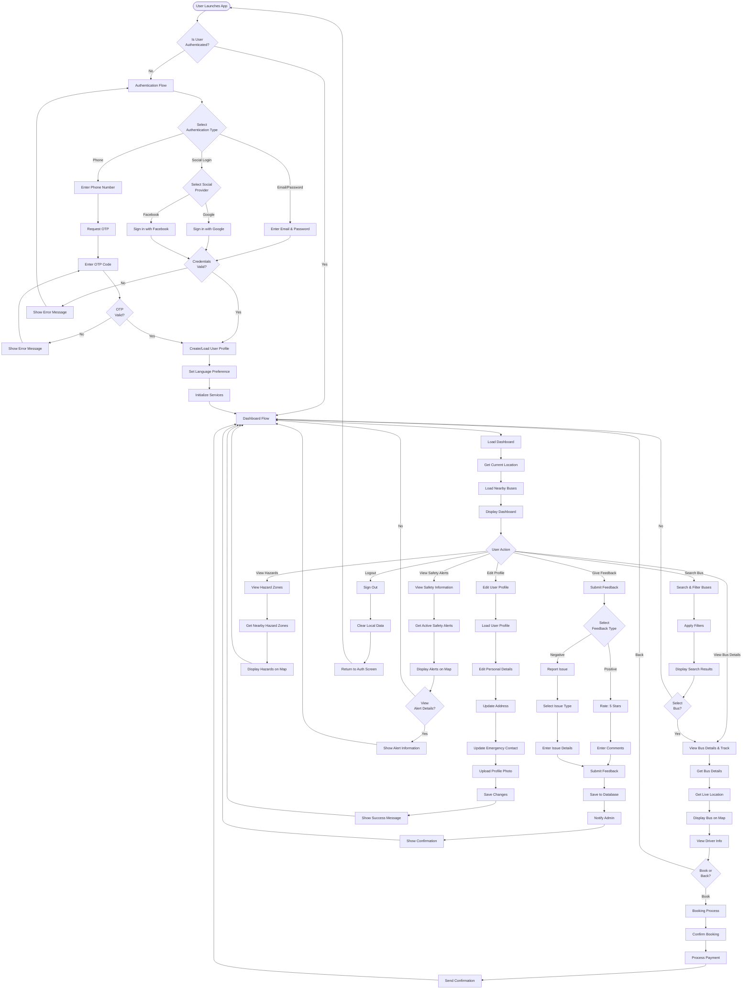

---

## 3. SEQUENCE DIAGRAM

Shows the interaction between different components during key user workflows.

### 3.1 User Authentication Sequence

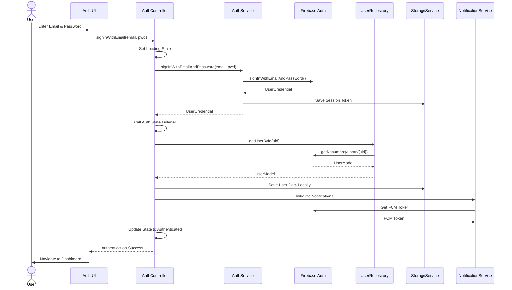

### 3.2 Bus Search and Tracking Sequence

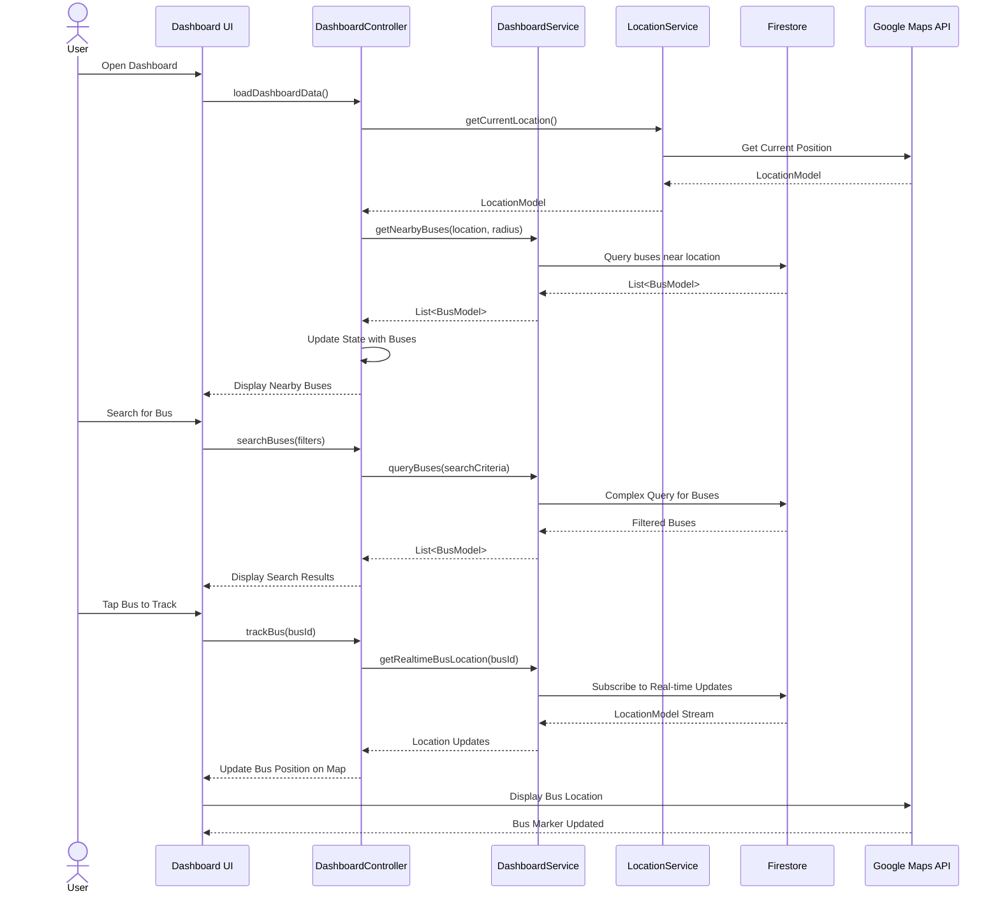

### 3.3 Feedback Submission Sequence

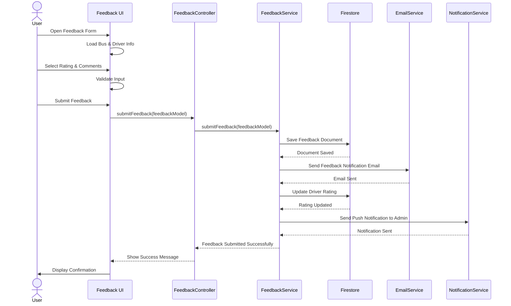

### 3.4 Safety Alert Reporting Sequence

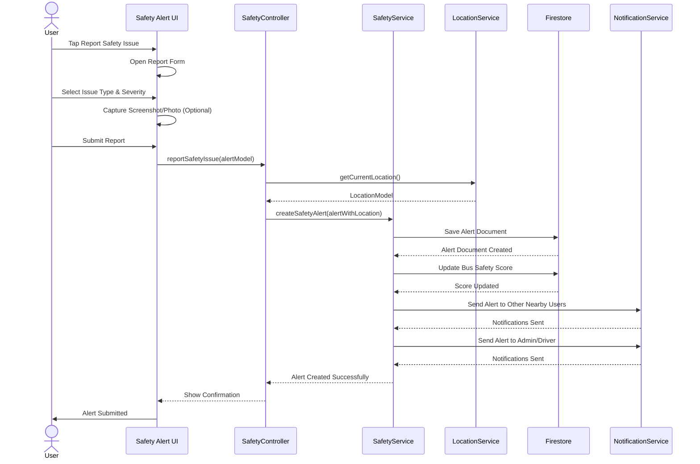

---

## 4. DESIGN PATTERNS

### 4.1 Singleton Pattern

**Usage**: Single instance across the entire application lifecycle

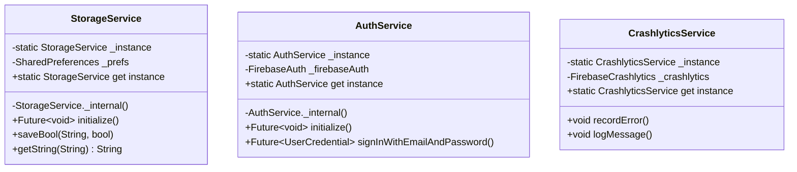

**Benefits**:
- Ensures single instance of resource-intensive services
- Centralized management of Firebase connections
- Thread-safe initialization

---

### 4.2 Repository Pattern

**Usage**: Abstract data access logic and provide a clean API

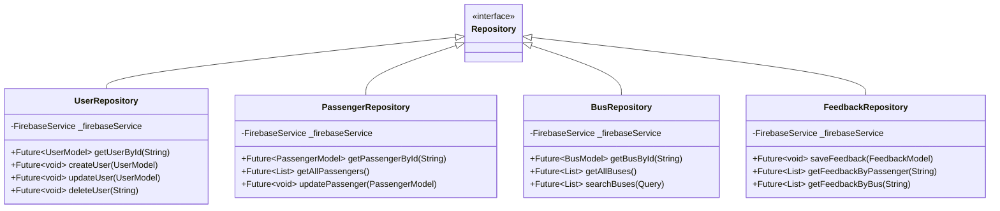

**Benefits**:
- Decouples business logic from data source
- Easy to mock for testing
- Centralized data access operations

---

### 4.3 Riverpod State Management Pattern

**Usage**: Manage application state with providers

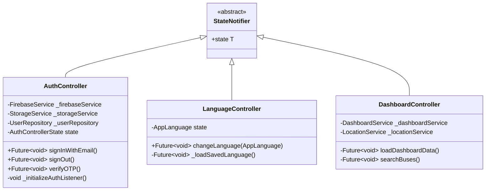

**Benefits**:
- Reactive state management
- Type-safe providers
- Easy to compose providers

---

### 4.4 Observer Pattern

**Usage**: Real-time data updates through streams

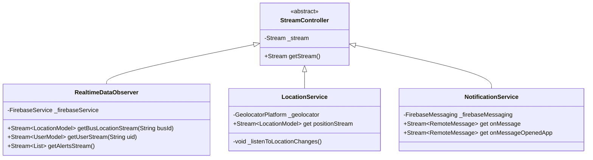

**Benefits**:
- Real-time updates without polling
- Reactive UI updates
- Efficient resource utilization

---

### 4.5 Factory Pattern

**Usage**: Create objects with different implementations

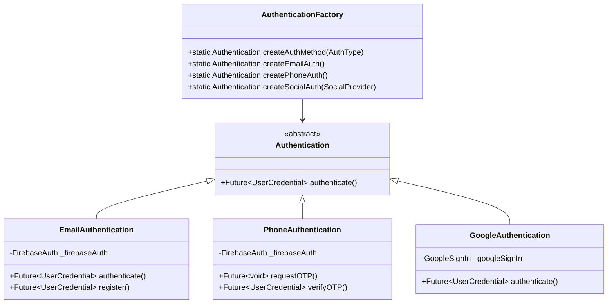

**Benefits**:
- Flexible object creation
- Easy to add new authentication methods
- Centralized object creation logic

---

### 4.6 Service Locator Pattern (Dependency Injection)

**Usage**: Manage dependencies and service instances

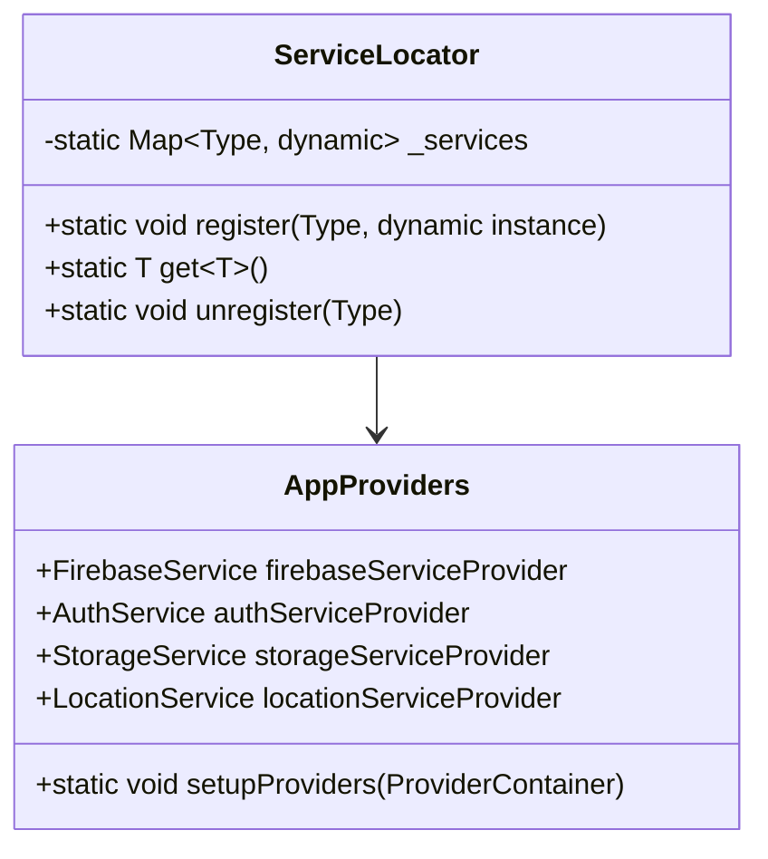

**Code Example** (from app_providers.dart):
```dart
final firebaseServiceProvider = Provider<FirebaseService>((ref) {
  return FirebaseService();
});

final authServiceProvider = Provider<AuthService>((ref) {
  return AuthService();
});

final authControllerProvider = StateNotifierProvider<AuthController, AuthControllerState>((ref) {
  return AuthController(
    firebaseService: ref.watch(firebaseServiceProvider),
    storageService: ref.watch(storageServiceProvider),
    notificationService: ref.watch(notificationServiceProvider),
    userRepository: ref.watch(userRepositoryProvider),
  );
});
```

**Benefits**:
- Centralized dependency management
- Loose coupling between components
- Easy to swap implementations for testing

---

### 4.7 Builder Pattern

**Usage**: Construct complex objects step by step

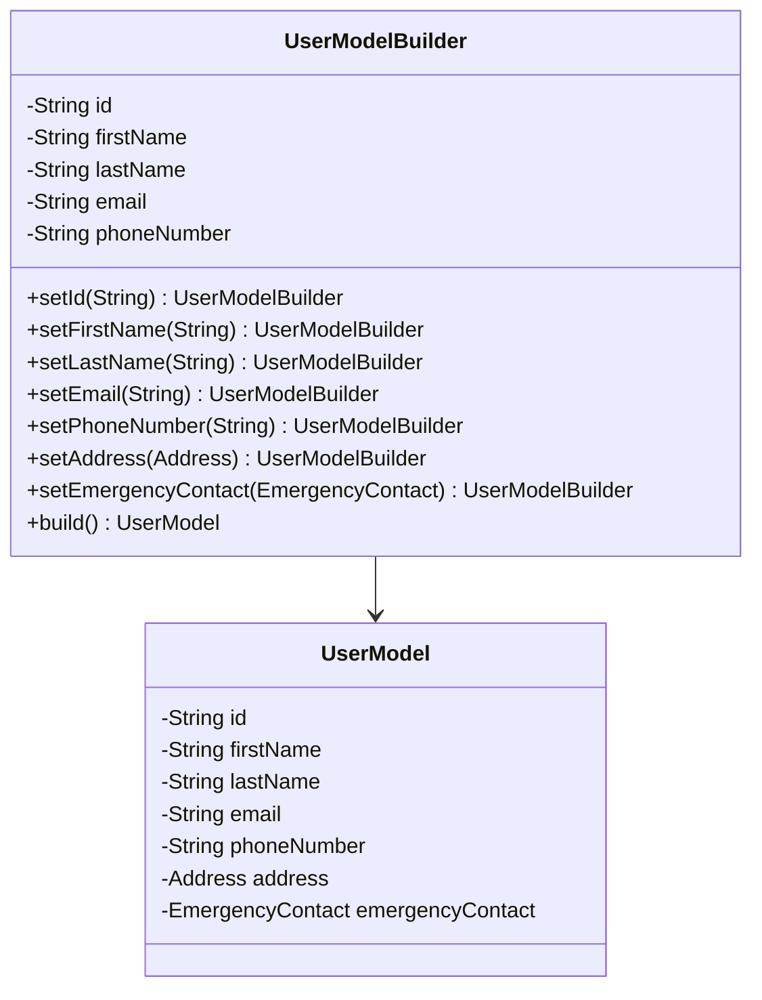

**Benefits**:
- Readable object construction
- Default values support
- Validation at build time

---

### 4.8 Strategy Pattern

**Usage**: Select different algorithms at runtime

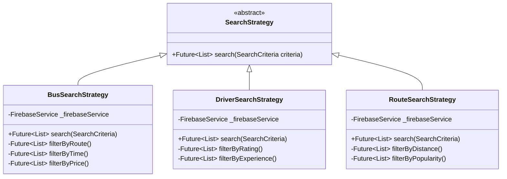

**Benefits**:
- Flexible algorithm selection
- Easy to add new search strategies
- Runtime behavior modification

---

### 4.9 Adapter Pattern

**Usage**: Convert incompatible interfaces

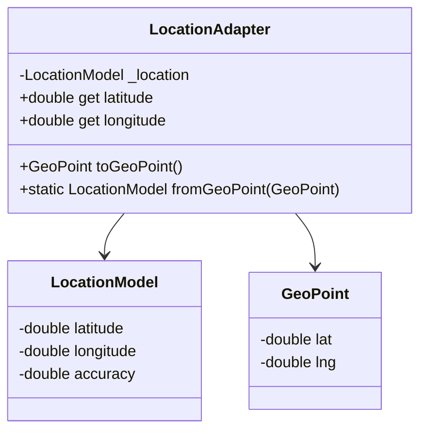

**Benefits**:
- Seamless integration with third-party libraries
- Reduces code duplication
- Centralizes conversion logic

---

### 4.10 Facade Pattern

**Usage**: Provide simplified interface to complex subsystem

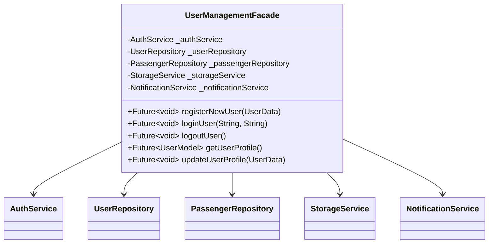

**Benefits**:
- Simplified API for clients
- Reduces dependencies
- Easier to test

---

## 5. ARCHITECTURAL PATTERNS

### 5.1 Clean Architecture (MVVM)

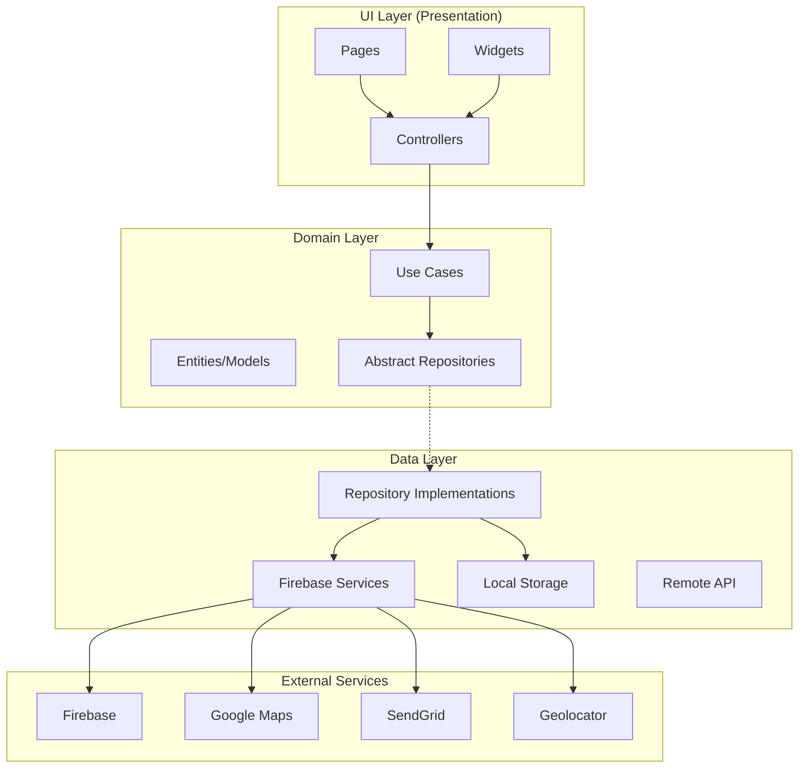

**Key Principles**:
- **Separation of Concerns**: Each layer has specific responsibilities
- **Dependency Inversion**: High-level modules depend on abstractions
- **Testability**: Each layer can be tested independently
- **Maintainability**: Changes in one layer don't affect others

---

### 5.2 State Management Architecture

```mermaid
graph LR
    User["User Interaction"]
    UI["UI (Pages/Widgets)"]
    Provider["Riverpod Providers"]
    Controller["StateNotifier Controller"]
    Service["Business Logic Service"]
    Repository["Repository"]
    DataSource["Data Source (Firebase/Local)"]

    User -->|User Action| UI
    UI -->|Watch Provider| Provider
    Provider -->|Get State| Controller
    Controller -->|Call Methods| Service
    Service -->|CRUD Operations| Repository
    Repository -->|Fetch/Save| DataSource
    DataSource -->|Return Data| Repository
    Repository -->|Return Data| Service
    Service -->|Update State| Controller
    Controller -->|Emit New State| Provider
    Provider -->|Rebuild UI| UI
```

---

## 6. DESIGN PATTERNS SUMMARY TABLE

| Pattern | Location | Purpose | Benefits |
|---------|----------|---------|----------|
| **Singleton** | Services (AuthService, StorageService) | Single instance management | Centralized control, resource efficiency |
| **Repository** | data/repositories/ | Abstract data access | Loose coupling, testability |
| **State Notifier** | controllers/ & providers/ | State management | Reactive UI, type safety |
| **Observer** | LocationService, NotificationService | Real-time updates | Reactive updates, efficiency |
| **Factory** | Authentication methods | Object creation | Flexibility, easy extension |
| **Service Locator** | app_providers.dart | Dependency injection | Loose coupling, modularity |
| **Builder** | Models | Complex object construction | Readable code, validation |
| **Strategy** | Search/Query operations | Algorithm selection | Flexibility, maintainability |
| **Adapter** | Model converters | Interface compatibility | Integration, reusability |
| **Facade** | UserManagementFacade | Simplified API | Usability, modularity |

---

## 7. TECHNOLOGY STACK

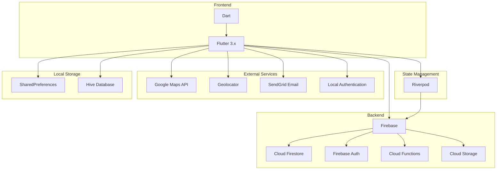

---

## 8. DATA FLOW EXAMPLE: User Authentication

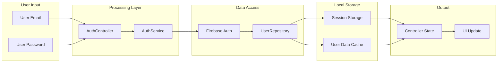

---

