# SafeDriver Passenger App - Scenario-Based Activity Diagrams

Detailed activity diagrams for each major use case and scenario in the SafeDriver application.

---

## 1. USER REGISTRATION FLOW

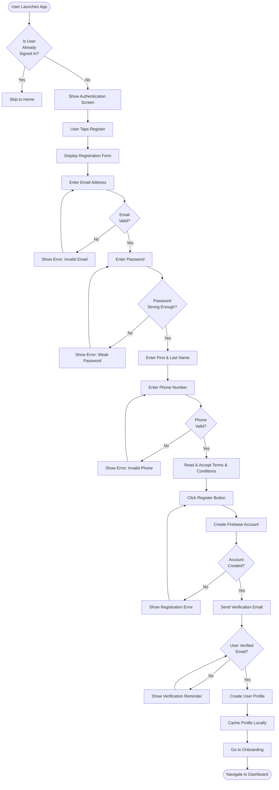

---

## 2. USER LOGIN FLOW (EMAIL/PASSWORD)

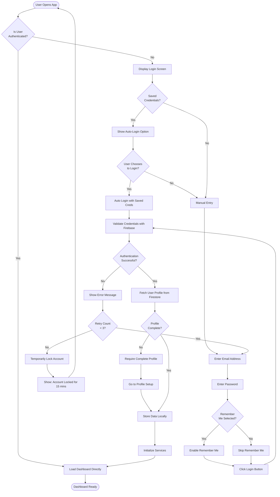

---

## 3. PHONE NUMBER AUTHENTICATION (OTP) FLOW

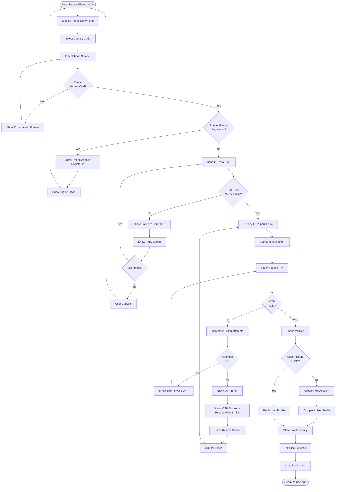

---

## 4. BUS SEARCH AND BOOKING FLOW

```mermaid
graph TD
    Start([User on Dashboard]) --> SelectSearch[Tap Search Bar]
    SelectSearch --> ShowSearchForm[Display Search Form]
    
    ShowSearchForm --> SelectSource[Select Source Location]
    SelectSource --> GetSourceLocation{Use Current<br/>Location?}
    
    GetSourceLocation -->|Yes| GetCurrent[Get Current Location]
    GetCurrent --> DisplaySource[Display Source]
    
    GetSourceLocation -->|No| SearchSource[Search Source Location]
    SearchSource --> SelectSourceManual[Select from Results]
    SelectSourceManual --> DisplaySource
    
    DisplaySource --> SelectDestination[Select Destination Location]
    SelectDestination --> SearchDest[Search Destination]
    SearchDest --> SelectDestManual[Select from Results]
    SelectDestManual --> DisplayDest[Display Destination]
    
    DisplayDest --> SelectDate[Select Travel Date]
    SelectDate --> ShowDatePicker[Show Date Picker]
    ShowDatePicker --> PickDate[Pick Date]
    PickDate --> SelectTime{Select<br/>Time?}
    
    SelectTime -->|Optional| SelectDepartTime[Select Departure Time]
    SelectDepartTime --> DisplayTime[Display Selected Time]
    
    SelectTime -->|Skip| DisplayTime
    
    DisplayTime --> SelectFilter[Select Additional Filters]
    SelectFilter --> ShowFilters[Bus Type, Price Range, Ratings]
    ShowFilters --> ApplyFilters[Apply Filters]
    
    ApplyFilters --> SearchBuses[Search Available Buses]
    SearchBuses --> LoadingScreen[Show Loading]
    LoadingScreen --> BusSearchResult{Buses<br/>Found?}
    
    BusSearchResult -->|No| ShowNoResult[Show: No Buses Available]
    ShowNoResult --> OfferAlternate[Offer Alternative Dates/Times]
    OfferAlternate --> SelectSearch
    
    BusSearchResult -->|Yes| DisplayList[Display Bus Search Results]
    DisplayList --> SortOptions[Show Sort Options]
    SortOptions --> ApplySort[Sort by Price/Rating/Time]
    ApplySort --> ViewResults[View Bus List]
    
    ViewResults --> SelectBus[User Selects a Bus]
    SelectBus --> ShowBusDetail[Display Bus Details Page]
    
    ShowBusDetail --> LoadBusInfo[Load Bus Info, Routes, Amenities]
    LoadBusInfo --> LoadSeats[Load Available Seats]
    LoadSeats --> LoadDriver[Load Driver Information]
    LoadDriver --> DisplayDetails[Display All Details]
    
    DisplayDetails --> UserChoice{User Wants<br/>to Book?}
    
    UserChoice -->|No| GoBack[Go Back to Search Results]
    GoBack --> ViewResults
    
    UserChoice -->|Yes| SelectSeats[Select Desired Seats]
    SelectSeats --> ShowSeating[Display Seating Chart]
    ShowSeating --> ClickSeat[Click to Select Seat]
    ClickSeat --> SeatSelected{Seat<br/>Available?}
    
    SeatSelected -->|No| ShowError[Show: Seat Unavailable]
    ShowError --> ShowSeating
    
    SeatSelected -->|Yes| AddSeat[Add Seat to Booking]
    AddSeat --> MoreSeats{Add More<br/>Seats?}
    
    MoreSeats -->|Yes| ClickSeat
    MoreSeats -->|No| ReviewBooking[Review Booking Summary]
    
    ReviewBooking --> ShowSummary[Show Price, Seats, Schedule]
    ShowSummary --> ProceedPayment[Tap Proceed to Payment]
    
    ProceedPayment --> SelectPaymentMethod[Select Payment Method]
    SelectPaymentMethod --> CreditCard[Credit/Debit Card]
    SelectPaymentMethod --> MobileWallet[Mobile Wallet]
    SelectPaymentMethod --> BankTransfer[Bank Transfer]
    
    CreditCard --> ProcessPayment[Process Payment]
    MobileWallet --> ProcessPayment
    BankTransfer --> ProcessPayment
    
    ProcessPayment --> PaymentLoading[Show Loading Animation]
    PaymentLoading --> PaymentResult{Payment<br/>Successful?}
    
    PaymentResult -->|No| PaymentError[Show Payment Error]
    PaymentError --> RetryPayment{User Retries?}
    RetryPayment -->|Yes| SelectPaymentMethod
    RetryPayment -->|No| SaveDraft[Save as Draft Booking]
    SaveDraft --> GoBack
    
    PaymentResult -->|Yes| CreateBooking[Create Booking Record]
    CreateBooking --> SaveBooking[Save to Firestore]
    SaveBooking --> SendConfirmation[Send Confirmation Email/SMS]
    SendConfirmation --> GenerateTicket[Generate E-Ticket]
    GenerateTicket --> ShowConfirmation[Show Booking Confirmation]
    
    ShowConfirmation --> DisplayTicket[Display E-Ticket with QR Code]
    DisplayTicket --> OfferOptions[Offer Download/Share Options]
    OfferOptions --> UserAction{User Action}
    
    UserAction -->|Download| DownloadTicket[Download as PDF]
    UserAction -->|Share| ShareTicket[Share via Social/Email]
    UserAction -->|Go Home| NavigateHome[Navigate to Dashboard]
    
    DownloadTicket --> NavigateHome
    ShareTicket --> NavigateHome
    NavigateHome --> End([Booking Complete])
```

---

## 5. FEEDBACK SUBMISSION FLOW

```mermaid
graph TD
    Start([Recent Trip Shown]) --> ShowFeedbackPrompt[Display Feedback Prompt]
    
    ShowFeedbackPrompt --> UserChoice{User Wants<br/>to Give<br/>Feedback?}
    
    UserChoice -->|Not Now| RemindLater[Remind Later]
    UserChoice -->|Dismiss| SkipFeedback[Skip Feedback]
    
    RemindLater --> End1([Continue])
    SkipFeedback --> End1
    
    UserChoice -->|Yes| OpenFeedback[Open Feedback Form]
    
    OpenFeedback --> SelectRating[Select Overall Rating]
    SelectRating --> DisplayStars[Display 5-Star Rating System]
    DisplayStars --> RateTrip[Rate Trip 1-5 Stars]
    
    RateTrip --> CheckRating{Rating<br/>Score?}
    
    CheckRating -->|1-2 Stars| ShowNegativeForm[Show Negative Feedback Form]
    CheckRating -->|3-4 Stars| ShowNeutralForm[Show Neutral Feedback Form]
    CheckRating -->|5 Stars| ShowPositiveForm[Show Positive Feedback Form]
    
    ShowNegativeForm --> SelectIssueType[Select Issue Category]
    SelectIssueType --> Issues["Safety, Comfort,<br/>Driver Behavior,<br/>Cleanliness, etc."]
    Issues --> ProvideDetails[Provide Issue Details]
    ProvideDetails --> CanAttach{Attach<br/>Photos/Video?}
    
    ShowNeutralForm --> EnterComment[Enter Additional Comments]
    EnterComment --> CanAttach
    
    ShowPositiveForm --> SelectProbs["Select Positive Aspects:<br/>Driver Behavior, Cleanliness,<br/>Comfort, Safety, etc."]
    SelectProbs --> EnterComment
    
    CanAttach -->|Yes| LaunchCamera[Launch Camera/Gallery]
    LaunchCamera --> CaptureMedia[Capture/Select Media]
    CaptureMedia --> PreviewMedia[Preview Media Files]
    PreviewMedia --> ConfirmMedia[Confirm Media Selection]
    ConfirmMedia --> DisplayAttached[Display Attached Files]
    
    CanAttach -->|No| DisplayAttached
    
    DisplayAttached --> DisplayForm[Display Complete Feedback Form]
    DisplayForm --> UserReview[User Reviews Feedback]
    UserReview --> EditChoice{Edit<br/>Needed?}
    
    EditChoice -->|Yes| EditFeedback[Edit Feedback Content]
    EditFeedback --> DisplayForm
    
    EditChoice -->|No| SubmitFeedback[Tap Submit Button]
    
    SubmitFeedback --> ValidateForm[Validate Form Data]
    ValidateForm --> ValidResult{Data<br/>Valid?}
    
    ValidResult -->|No| ShowValidError[Show Validation Error]
    ShowValidError --> EditFeedback
    
    ValidResult -->|Yes| EncryptData[Encrypt Sensitive Data]
    EncryptData --> UploadMedia[Upload Media to Cloud Storage]
    UploadMedia --> MediaUploaded{Media Upload<br/>Complete?}
    
    MediaUploaded -->|No| ShowUploadError[Show Upload Error]
    ShowUploadError --> RetryUpload{Retry?}
    RetryUpload -->|Yes| UploadMedia
    RetryUpload -->|No| SaveDraft[Save as Draft]
    SaveDraft --> End1
    
    MediaUploaded -->|Yes| SaveFeedback[Save Feedback to Firestore]
    SaveFeedback --> FeedbackSaved{Saved<br/>Successfully?}
    
    FeedbackSaved -->|No| ShowSaveError[Show Save Error]
    ShowSaveError --> RetrySubmit{Retry?}
    RetrySubmit -->|Yes| SaveFeedback
    RetrySubmit -->|No| SaveDraft
    
    FeedbackSaved -->|Yes| UpdateBusRating[Update Bus Rating Score]
    UpdateBusRating --> UpdateDriverRating[Update Driver Rating Score]
    UpdateDriverRating --> NotifyAdmin[Send Notification to Admin]
    NotifyAdmin --> NotifyDriver{Negative<br/>Feedback?}
    
    NotifyDriver -->|Yes| NotifyDriverMsg[Notify Driver about Feedback]
    NotifyDriver -->|No| SkipNotify[Skip Driver Notification]
    
    NotifyDriverMsg --> SendEmail[Send Feedback Confirmation Email]
    SkipNotify --> SendEmail
    
    SendEmail --> ShowSuccess[Display Success Message]
    ShowSuccess --> OfferReward[Offer Reward Points]
    OfferReward --> RewardUser[Add Points to Account]
    RewardUser --> ShowRewardMsg[Show Reward Confirmation]
    ShowRewardMsg --> DisplayOptions[Display Navigation Options]
    
    DisplayOptions --> UserNav{Next<br/>Action?}
    
    UserNav -->|View More| ViewMore[View More Feedback Options]
    UserNav -->|Home| GoHome[Navigate to Dashboard]
    UserNav -->|Trip History| ViewHistory[View Trip History]
    
    ViewMore --> End1
    GoHome --> End1
    ViewHistory --> End1
```

---

## 6. REAL-TIME BUS TRACKING FLOW

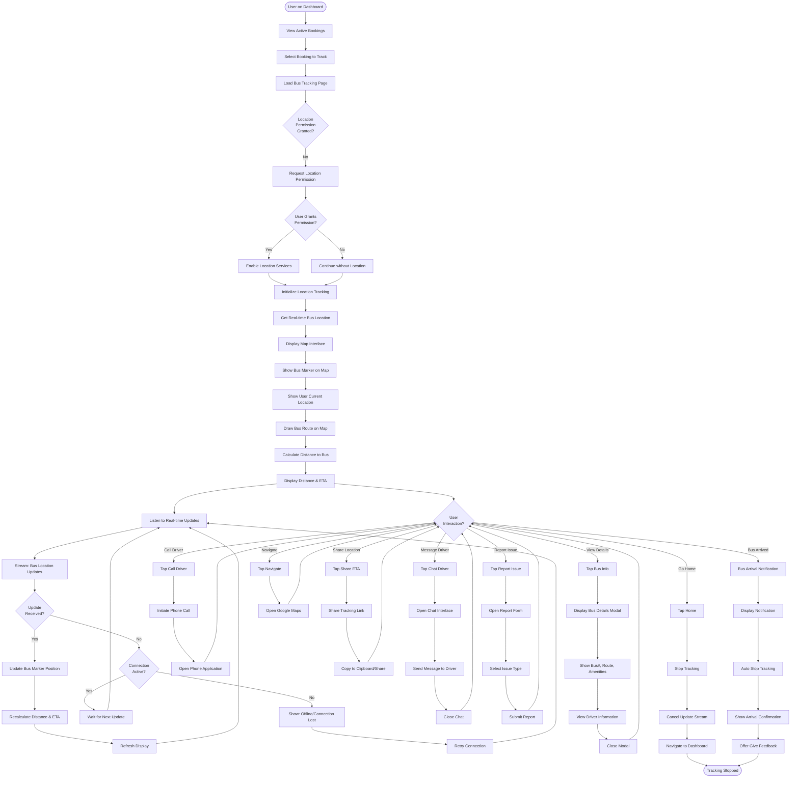

---

## 7. SAFETY ALERT REPORTING FLOW

```mermaid
graph TD
    Start([Emergency/Safety Issue Occurs]) --> ReportOption1{Report<br/>Method?}
    
    ReportOption1 -->|Floating Button| TapButton[Tap Floating Report Button]
    ReportOption1 -->|Menu| OpenMenu[Open App Menu]
    OpenMenu --> TapReport[Select Report Option]
    
    TapButton --> ShowReportForm[Display Report Form]
    TapReport --> ShowReportForm
    
    ShowReportForm --> SelectCategory[Select Issue Category]
    SelectCategory --> ShowCategories["- Unsafe Driving<br/>- Hazardous Road Condition<br/>- Accident<br/>- Vehicle Issue<br/>- Harassment/Assault<br/>- Other"]
    
    ShowCategories --> PickCategory[Pick Issue Category]
    PickCategory --> ShowSubForm[Display Subcategory Form]
    
    ShowSubForm --> SelectSeverity[Select Severity Level]
    SelectSeverity --> ShowSeverity["- Critical (Immediate Danger)<br/>- High (Serious Issue)<br/>- Medium (Concern)<br/>- Low (Minor Issue)"]
    
    ShowSeverity --> PickSeverity[Pick Severity Level]
    PickSeverity --> CheckCritical{Critical<br/>Severity?}
    
    CheckCritical -->|Yes| AlertEmergency[Alert Emergency Services]
    AlertEmergency --> ShowWarning[Show: Emergency Alert Sent]
    CheckCritical -->|No| Continue1[Continue with Report]
    
    ShowWarning --> Continue1
    
    Continue1 --> EnterDescription[Enter Description Details]
    EnterDescription --> TextInput[Type Problem Description]
    TextInput --> CharCount[Show Character Count]
    CharCount --> EnterLocation[Confirm Location]
    
    EnterLocation --> GetLocation{Use Current<br/>Location?}
    
    GetLocation -->|Yes| GetCurrent[Get GPS Coordinates]
    GetCurrent --> DisplayLocation[Display Location on Map]
    
    GetLocation -->|No| SelectOnMap[Select Location on Map]
    SelectOnMap --> DisplayLocation
    
    DisplayLocation --> AddMedia[Add Evidence Media]
    AddMedia --> MediaOption{Add<br/>Photos/Video?}
    
    MediaOption -->|Yes| LaunchCamera[Launch Camera/Gallery]
    LaunchCamera --> CaptureMedia[Capture/Select Media]
    CaptureMedia --> PreviewMedia[Preview Captured Media]
    PreviewMedia --> AddMore{Add More<br/>Media?}
    AddMore -->|Yes| LaunchCamera
    AddMore -->|No| ReviewMedia[Review All Media]
    
    MediaOption -->|No| ReviewMedia
    
    ReviewMedia --> DisplayMediaList[Display Media List]
    DisplayMediaList --> SelectAnonymous{Report<br/>Anonymously?}
    
    SelectAnonymous -->|Yes| SetAnonymous[Set as Anonymous Report]
    SelectAnonymous -->|No| UseIdentity[Use Identity Information]
    
    SetAnonymous --> ReviewReport[Review Full Report]
    UseIdentity --> ReviewReport
    
    ReviewReport --> DisplaySummary[Display Report Summary]
    DisplaySummary --> UserVerify{User Confirms<br/>Report?}
    
    UserVerify -->|No| EditReport[Edit Report Content]
    EditReport --> ReviewReport
    
    UserVerify -->|Yes| SubmitReport[Submit Report]
    
    SubmitReport --> ValidateData[Validate Report Data]
    ValidateData --> ValidOK{Data Valid?}
    
    ValidOK -->|No| ShowError[Show Validation Error]
    ShowError --> EditReport
    
    ValidOK -->|Yes| UploadMedia[Upload Media Files]
    UploadMedia --> UploadProgress[Show Upload Progress]
    UploadProgress --> MediaUploaded{All Media<br/>Uploaded?}
    
    MediaUploaded -->|No| UploadFailed[Upload Failed]
    UploadFailed --> RetryUpload{Retry?}
    RetryUpload -->|Yes| UploadMedia
    RetryUpload -->|No| SaveDraft[Save as Draft]
    SaveDraft --> ShowDraftMsg[Show: Saved as Draft]
    ShowDraftMsg --> End1([Return to App])
    
    MediaUploaded -->|Yes| EncryptData[Encrypt Report Data]
    EncryptData --> SaveReport[Save Report to Firestore]
    SaveReport --> ReportSaved{Saved<br/>Successfully?}
    
    ReportSaved -->|No| ShowSaveError[Show Save Error]
    ShowSaveError --> RetrySubmit{Retry?}
    RetrySubmit -->|Yes| SaveReport
    RetrySubmit -->|No| SaveDraft
    
    ReportSaved -->|Yes| GenerateID[Generate Report ID]
    GenerateID --> NotifyAdmin[Send Alert to Safety Team]
    NotifyAdmin --> CheckCritical2{Critical<br/>Report?}
    
    CheckCritical2 -->|Yes| AlertPolice[Alert Local Police/Emergency]
    CheckCritical2 -->|No| Standard[Standard Processing]
    
    AlertPolice --> NotifyDriver[Send Report to Driver]
    Standard --> NotifyDriver
    
    NotifyDriver --> SendEmail[Send Email Confirmation]
    SendEmail --> ShowConfirm[Display Confirmation Page]
    
    ShowConfirm --> DisplayID[Show Report ID & Reference]
    DisplayID --> ShowNext[Show Next Steps]
    ShowNext --> OfferSupport[Offer Support Resources]
    OfferSupport --> UserChoice{User Action}
    
    UserChoice -->|View Report| ViewReport[View Submitted Report]
    UserChoice -->|Call Support| CallSupport[Call Safety Support]
    UserChoice -->|Go Home| GoHome[Navigate to Dashboard]
    
    ViewReport --> End1
    CallSupport --> End1
    GoHome --> End1
```

---

## 8. USER PROFILE MANAGEMENT FLOW

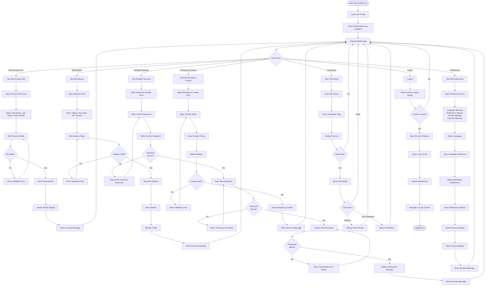

---

## 9. LANGUAGE PREFERENCE SETTING FLOW

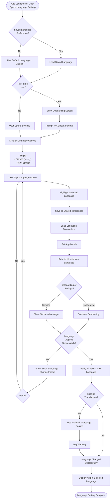

---

## 10. PAYMENT PROCESSING FLOW

```mermaid
graph TD
    Start([User Taps Proceed to Payment]) --> DisplayPaymentMethods[Display Payment Methods]
    
    DisplayPaymentMethods --> SelectMethod{Select Payment<br/>Method}
    
    SelectMethod -->|Credit/Debit Card| CardFlow[Card Payment Flow]
    SelectMethod -->|Mobile Wallet| WalletFlow[Wallet Payment Flow]
    SelectMethod -->|Net Banking| BankFlow[Bank Transfer Flow]
    SelectMethod -->|Save for Later| SaveDraft[Save Booking Draft]
    
    SaveDraft --> End1([Return to Dashboard])
    
    %% Card Payment
    CardFlow --> ShowCardForm[Display Card Entry Form]
    ShowCardForm --> EnterCardNo[Enter Card Number]
    EnterCardNo --> ValidateCardNo{Card No<br/>Valid?}
    ValidateCardNo -->|No| ShowError1[Show: Invalid Card Number]
    ShowError1 --> EnterCardNo
    ValidateCardNo -->|Yes| EnterExpiry[Enter Expiry Date]
    EnterExpiry --> ValidateExpiry{Card<br/>Not Expired?}
    ValidateExpiry -->|No| ShowError2[Show: Card Expired]
    ShowError2 --> EnterExpiry
    ValidateExpiry -->|Yes| EnterCVV[Enter CVV]
    EnterCVV --> EnterBillingAddr[Enter Billing Address]
    EnterBillingAddr --> EnterName[Enter Cardholder Name]
    EnterName --> ReviewCard[Review Card Details]
    ReviewCard --> EncryptCard[Encrypt Card Details]
    EncryptCard --> InitCardPayment[Initiate Card Payment]
    
    %% Mobile Wallet
    WalletFlow --> ShowWalletOptions[Display Wallet Apps]
    ShowWalletOptions --> SelectWallet["Apple Pay, Google Pay,<br/>Samsung Pay, PayPal"]
    SelectWallet --> LaunchWallet[Launch Wallet Application]
    LaunchWallet --> AuthPayment[Authenticate Payment]
    AuthPayment --> InitWalletPayment[Initiate Wallet Payment]
    
    %% Bank Transfer
    BankFlow --> ShowBankOptions[Display Bank Options]
    ShowBankOptions --> SelectBank[Select Bank]
    SelectBank --> ShowBankDetails[Show Bank Account Details]
    ShowBankDetails --> DisplayRef[Display Reference Number]
    DisplayRef --> OpenBank[Open Bank App/Website]
    OpenBank --> UserTransfers[User Transfers Money]
    UserTransfers --> ShowInstruct[Show Verification Instructions]
    ShowInstruct --> WaitVerification[Wait for Payment Verification]
    WaitVerification --> ManualVerify[Admin Manual Verification]
    ManualVerify --> VerifySuccess{Payment<br/>Verified?}
    
    %% Common Payment Processing
    InitCardPayment --> ProcessPayment[Process Payment]
    InitWalletPayment --> ProcessPayment
    ManualVerify --> ProcessPayment
    
    ProcessPayment --> ContactGateway[Contact Payment Gateway]
    ContactGateway --> ShowLoading[Show Loading Animation]
    ShowLoading --> PaymentResult{Payment<br/>Successful?}
    
    PaymentResult -->|Failed| HandleFailure[Handle Payment Failure]
    HandleFailure --> ErrorType{Error Type?}
    
    ErrorType -->|Insufficient Funds| ShowInsufficient[Show: Insufficient Funds]
    ErrorType -->|Card Declined| ShowDeclined[Show: Card Declined]
    ErrorType -->|Network Error| ShowNetError[Show: Network Error]
    ErrorType -->|Timeout| ShowTimeout[Show: Payment Timeout]
    
    ShowInsufficient --> OfferRetry{Retry or<br/>Change Method?}
    ShowDeclined --> OfferRetry
    ShowNetError --> OfferRetry
    ShowTimeout --> OfferRetry
    
    OfferRetry -->|Retry| SelectMethod
    OfferRetry -->|Change Method| DisplayPaymentMethods
    OfferRetry -->|Save Draft| SaveDraft
    
    PaymentResult -->|Successful| ReceiptNo[Generate Receipt Number]
    ReceiptNo --> RecordTransaction[Record Transaction in DB]
    RecordTransaction --> UpdateBooking[Update Booking Status to PAID]
    UpdateBooking --> SaveTransRef[Save Transaction Reference]
    SaveTransRef --> SendReceipt[Send Payment Receipt Email]
    SendReceipt --> ShowSuccessMsg[Display Success Message]
    
    ShowSuccessMsg --> DisplayReceipt[Show Payment Receipt]
    DisplayReceipt --> OfferOptions{User Action?}
    
    OfferOptions -->|Download Receipt| DownloadReceipt[Download Receipt PDF]
    OfferOptions -->|Share Receipt| ShareReceipt[Share Receipt]
    OfferOptions -->|Continue| Continue[Continue to Booking Confirmation]
    
    DownloadReceipt --> Continue
    ShareReceipt --> Continue
    Continue --> GenerateTicket[Generate E-Ticket]
    GenerateTicket --> DisplayTicket[Display Bus Ticket]
    DisplayTicket --> End2([Payment Complete])
```

---

## 11. OTP VERIFICATION AND REGISTRATION FLOW

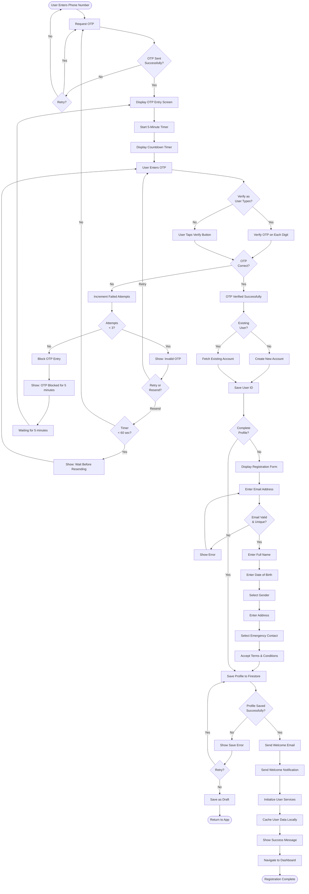

---

## 12. HAZARD ZONE AND SAFETY INFORMATION FLOW

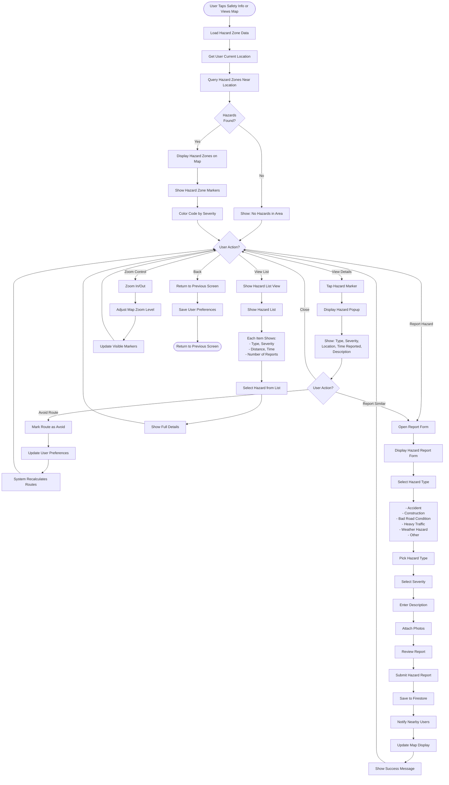

---

